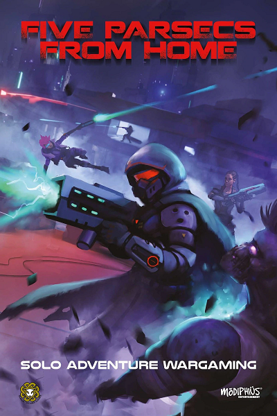

# Parsecs

## Tasks

- [ ] Home Layout (base route)
    - [ ] Campaign Save Management
    - [ ] New Campaign
    - [ ] Campaign Cards
    - [ ] Search (campaign name, character search function for roster.some(c => c.search(val)))
- [ ] New Campaign Workflow (`/new-campaign`)
    - [ ] Initial Settings and Characters
    - [ ] Finalize and Route to Campaign
- [ ] Campaign Route (`/campaign/:id`)
- [ ] Inventory Management System
    - [ ] Character
    - [ ] Crew
- [ ] Campaign Turn Processor
    - [ ] Travel
    - [ ] World
    - [ ] Battle Management
        * Turn Tracking
        * Character / Enemy Status Tracking
        * Engagement calculations
        * Shooting Hit / Damage Calculations
        * Brawling Calculations
    - [ ] Post-Battle

### Firebase Integration - Initial Scope

* An authenticated Player can create and run Campaigns.

* Additional players can be invited to play as crew members within an authenticated Player's campaign.

* Campaign owners, as well as invited players, earn Elite Ranks tracked on their player account.

* Narrative timeline feature that tracks the evolution of the story as it progresses, with players able to optionally generate specific details at any major campaign event.

### Further Out Tasks

* Integrate the [Trailblazer's Toolkit Expansion](https://www.modiphius.net/products/five-parsecs-from-home-expansion-1-trailblazers-toolkit-pdf) updates.

* GM features

* Campaign type that supports multiple players simultaneously running multiple crews within the same game world (either cooperatively or competitively).

### Layout Notes

Toolbar Features:
* Links to [Five Parsecs from Home](https://www.modiphius.net/en-us/pages/five-parsecs) game.
* Authentication management
* If authenticated, ability to create a new Campaign.

Routes:
* `{app-url}`
    * If authenticated, Shows all campaigns available to the player split into two categories:
        * Owned
        * Participating
        * If not authenticated, provides an overview of the app.
* `{app-url}/{campaign}`
    * The root route to the campaign management interface. From this point, the campaign engine will drive the avaialble interactive features.
